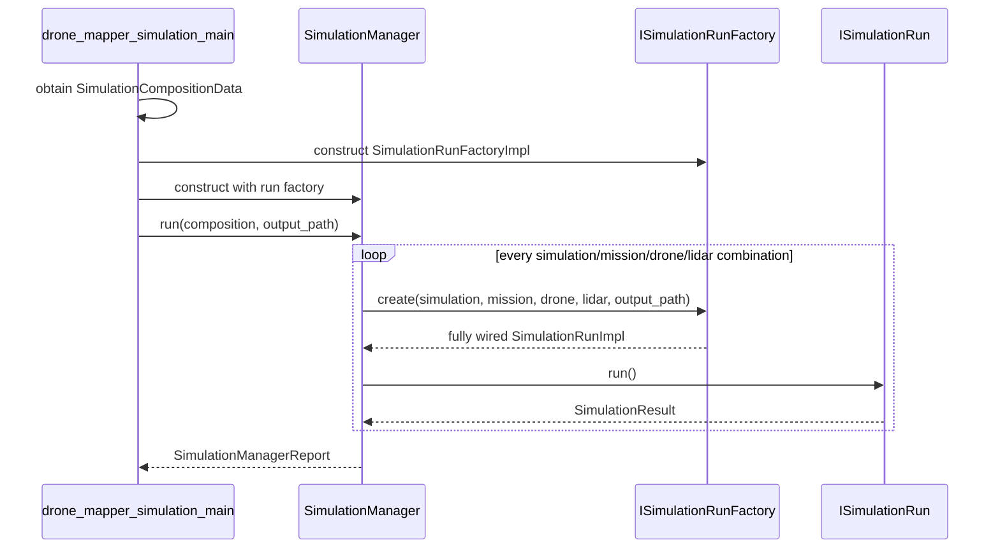
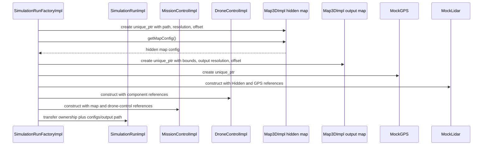
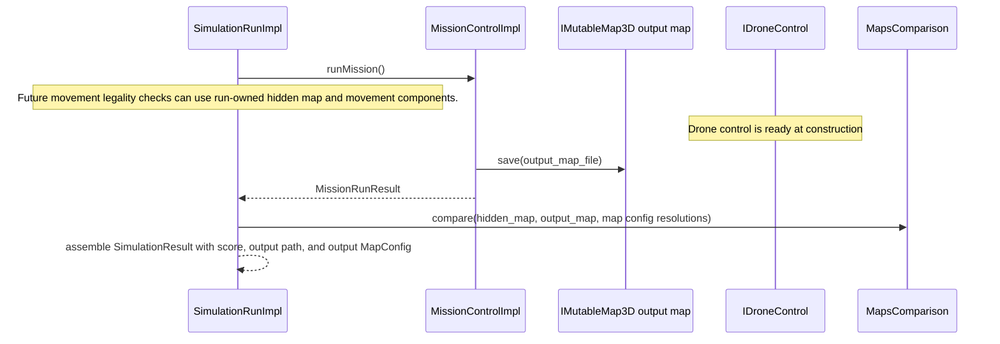

# Assignment 2 HLD

**Student:** omri-boiman (boiman.omri@gmail.com)

This document describes the high-level design of the Assignment 2 simulator, covering both the skeleton architecture and the student implementation of `MappingAlgorithmImpl`.

---

## Student Implementation — MappingAlgorithmImpl

Only `MappingAlgorithmImpl.cpp` and `MappingAlgorithmImpl.h` were modified from the skeleton.

### Algorithm Overview

`MappingAlgorithmImpl` implements **frontier-based 3D exploration**. The drone iteratively selects the most informative unexplored region (frontier), navigates to it via 3D A\*, performs a 360° scan, and repeats until no reachable frontiers remain or the step budget is exhausted.

Each call to `nextStep()` follows this priority order:

1. **Bootstrap** — if the drone starts outside the map array (e.g. house scenario: drone at z=10 cm, map at z=150 cm), issue single Elevate/Advance commands until inside the map boundary.
2. **Drain** — emit the next queued movement command from `pending_commands_`.
3. **Scan** — on arrival at a waypoint, perform a 360° yaw sweep (32 or 64 steps depending on map size).
4. **Select** — pick the best frontier via value-scored BFS.
5. **Plan** — build a movement queue: A\* path → rotate + advance/elevate commands.

### Frontier Selection

A BFS expands navigable voxels from the drone's current cell. Each frontier is scored:

```
score = (gain + w_struct × structure) / (1 + β × dist)
```

- **gain** — Unmapped voxels in an L³ neighbourhood (information value)
- **structure** — Occupied voxels in the same neighbourhood (interior preference for larger drones)
- **dist** — BFS hop count from current position
- **w\_struct** = 4.0 for drones whose radius spans ≥ 1 voxel; 0.0 for smaller drones
- **β** = 0.15 (distance penalty)

Two guards prevent loops: the last 8 targets are excluded (anti-oscillation), and any frontier attempted ≥ 5 times is permanently blacklisted.

### 3D A\* Navigation

A\* over the 6-connected voxel grid with Manhattan heuristic. A cell is passable (`clearForBody`) when:

1. `stateOf(c) == Empty`
2. No Occupied/PotentiallyOccupied/OutOfBounds voxel within the drone's spherical radius
3. No horizontal face-neighbour is Unmapped (prevents hugging unresolved walls; vertical Unmapped neighbours are ignored to avoid deadlocks in buildings with limited-coverage lidar)
4. Cell is within `mission_config_.mission_bounds`

When the goal is unreachable, A\* falls back to the closest passable cell reached.

### Key Fixes

| Fix | Description |
|-----|-------------|
| **Bootstrap navigation** | Drone navigates into the map array before the first scan when it starts outside (house scenario). |
| **Adaptive rotation step** | Maps with physical size < 200 cm use 5.625° steps (64/sweep) for higher angular density; larger maps use 11.25° (32/sweep) to fit more frontier visits within budget. |
| **Mission bounds enforcement** | Frontier BFS, A\* path planning, and `isFrontier` all reject cells outside `mission_config_.mission_bounds`. Prevents the drone from entering building sections or altitude ranges outside the mission area — the root cause of latent `DRONE_HITS_OBSTACLE` crashes at extended step budgets. |

### Navigability — Two Levels

Two predicates control cell access:

| Predicate | Used by | Unmapped sphere neighbours | Unmapped horizontal face |
|-----------|---------|--------------------------|--------------------------|
| `navigable()` | Frontier BFS | ✗ blocked | allowed |
| `clearForBody()` | A\* path planning | ✗ blocked | ✗ blocked |

`navigable()` is looser: it allows the drone to stand next to an Unmapped wall (that is the point of a frontier). `clearForBody()` is strict: it blocks any horizontal Unmapped face-neighbour to prevent the path from hugging walls that haven't been observed yet.

### Termination

The algorithm declares `FinishedWithUnmappableVoxels` in two cases:

- `selectBestFrontier` returns the sentinel cell even after clearing the anti-oscillation guard (no reachable frontier remains).
- `stuck_scan_count_` exceeds 10 — the drone has performed 10 consecutive full sweeps without moving, meaning the remaining frontiers are unreachable from any accessible position.

### Scan Coverage

Each waypoint triggers a 360° sweep. All scan requests use altitude = 0° (horizontal) as required. The `output_mapping_resolution_factor: 2` setting in each professor mission config aligns the output map resolution (5 cm × 2 = 10 cm) with the hidden map resolution, ensuring correct voxel-level comparison during scoring.

---

## Main Components

- `SimulationManager` is the top-level runner. It receives `types::SimulationCompositionData`, expands the cartesian product, and aggregates a `types::SimulationManagerReport`.
- `ISimulationRunFactory` is the single construction seam. It creates one fully wired run node for one simulation/mission/drone/LiDAR combination.
- `SimulationRunImpl` owns the full per-node runtime object graph, including maps, hardware-like components, drone control, and mission control. It also carries the simulation/mission config and output map path needed to return `types::SimulationResult`.
- `MissionControlImpl` receives references to the simulation-run-owned maps and drone control, saves the output map, and returns mission-level status/errors.
- `DroneControlImpl` receives required configs and references to simulation-run-owned dependencies, so it is ready at construction.
- `IMap3D` is read-only and exposes voxel lookup plus `types::MapConfig`, which groups boundaries, offset, and resolution. `IMutableMap3D` adds mutation and saving for output maps.
- Public signatures use explicit `types::...` names from focused headers. `SimulationTypes.h` holds simulator-only composition/report types.

## Map Geometry And Results

- `types::MapConfig` is the canonical map-geometry bundle: `MappingBounds`, `Position3D offset`, and `PhysicalLength resolution`.
- `types::SimulationConfigData` provides the hidden map file, hidden map resolution, map offset, initial drone position, and initial heading.
- `types::MissionConfigData` no longer owns mapping boundaries. Mission configuration is limited to mission behavior and requested output resolution parameters.
- `types::MissionRunResult` contains mission status, step count, and mission-level errors.
- `types::SimulationResult` contains one run's configs, mission results, output map file, output map config, resolution request status, and final score.
- `types::SimulationManagerReport` is the top-level aggregate over all generated `SimulationResult` runs.

## Class Diagram

```mermaid
classDiagram
    direction LR

    class ISimulation {
        <<interface>>
        +run(composition, output_path) report
    }

    class ISimulationRun {
        <<interface>>
        +run() result
    }

    class ISimulationRunFactory {
        <<interface>>
        +create(sim, mission, drone, lidar, output_path) run
    }

    class IMissionControl {
        <<interface>>
        +runMission() result
    }

    class IDroneControl {
        <<interface>>
        +step() step_result
        +state() state
    }

    class ILidar {
        <<interface>>
        +scan(orientation) scan
    }

    class IGPS {
        <<interface>>
        +position() position
        +heading() orientation
    }

    class IDroneMovement {
        <<interface>>
        +rotate(direction, angle) move_result
        +advance(distance) move_result
        +elevate(distance) move_result
    }

    class IMappingAlgorithm {
        <<interface>>
        +nextMove(state, latest_scan) command
        +applyVoxelUpdates(voxels) void
    }

    class IMap3D {
        <<interface>>
        +atVoxel(pos) occupancy
        +getMapConfig() config
    }

    class IMutableMap3D {
        <<interface>>
        +set(pos, value) void
        +save(output_file) void
    }

    class SimulationManager {
        -unique_ptr~ISimulationRunFactory~ run_factory_
        +SimulationManager(run_factory)
        +run(composition, output_path) report
    }

    class SimulationRunFactoryImpl {
        +create(sim, mission, drone, lidar, output_path) run
    }

    class SimulationRunImpl {
        -unique_ptr~const IMap3D~ hidden_map_
        -unique_ptr~IMutableMap3D~ output_map_
        -unique_ptr~IGPS~ gps_
        -unique_ptr~IDroneMovement~ movement_
        -unique_ptr~ILidar~ lidar_
        -unique_ptr~IMappingAlgorithm~ mapping_algorithm_
        -unique_ptr~IDroneControl~ drone_control_
        -unique_ptr~IMissionControl~ mission_control_
        -SimulationConfigData simulation_config_
        -MissionConfigData mission_config_
        -path output_map_file_
        +SimulationRunImpl(runtime_objects, configs, output_file)
        +run() simulation_result
    }

    class MissionControlImpl {
        -MissionConfigData mission_
        -DroneConfigData drone_
        -IMap3D& hidden_map_
        -IMutableMap3D& output_map_
        -IDroneControl& drone_control_
        -path output_map_file_
        +MissionControlImpl(mission, drone, hidden_map&, output_map&, drone_control&, output_file)
        +runMission() result
    }

    class DroneControlImpl {
        -DroneConfigData drone_
        -MissionConfigData mission_
        -ILidar& lidar_
        -IGPS& gps_
        -IDroneMovement& movement_
        -IMutableMap3D& output_map_
        -IMappingAlgorithm& mapping_algorithm_
        +DroneControlImpl(drone, mission, lidar&, gps&, movement&, output_map&, mapping_algorithm&)
        +step() step_result
        +state() state
    }

    class MockLidar {
        -LidarConfigData config_
        -IMap3D& hidden_map_
        -IGPS& gps_
        +MockLidar(config, map&, gps&)
        +scan(orientation) scan
    }

    class Map3DImpl {
        -shared_ptr~NpyArray~ map_
        -MapConfig config_
        +Map3DImpl(path, resolution)
        +Map3DImpl(path, resolution, offset)
        +Map3DImpl(bounds, resolution, offset)
        +atVoxel(pos) occupancy
        +getMapConfig() config
        +set(pos, value) void
        +save(output_file) void
    }

    class MapsComparison {
        +compare(expected&, actual&, resolution) score
        +compare(expected_file, actual_file, resolution) score
    }

    class MapConfig {
        +MappingBounds boundaries
        +Position3D offset
        +PhysicalLength resolution
    }

    class SimulationResult {
        +SimulationConfigData simulation_config
        +MissionConfigData mission_config
        +ResolutionRequestStatus resolution_request_status
        +vector~MissionRunResult~ mission_results
        +path output_map_file
        +MapConfig output_map_config
        +double mission_score
    }

    class SimulationManagerReport {
        +string generated_at_utc
        +string metric
        +tuple~double,double~ score_range
        +int error_score
        +vector~SimulationResult~ runs
    }

    ISimulation <|.. SimulationManager
    ISimulationRunFactory <|.. SimulationRunFactoryImpl
    ISimulationRun <|.. SimulationRunImpl
    IMissionControl <|.. MissionControlImpl
    IDroneControl <|.. DroneControlImpl
    ILidar <|.. MockLidar
    IMap3D <|-- IMutableMap3D
    IMutableMap3D <|.. Map3DImpl

    SimulationManager --> ISimulationRunFactory
    SimulationRunFactoryImpl --> SimulationRunImpl : transfers ownership
    SimulationRunImpl --> IMap3D : owns hidden map
    SimulationRunImpl --> IMutableMap3D : owns output map
    SimulationRunImpl --> IGPS
    SimulationRunImpl --> IDroneMovement
    SimulationRunImpl --> ILidar
    SimulationRunImpl --> IMappingAlgorithm
    SimulationRunImpl --> IDroneControl
    SimulationRunImpl --> IMissionControl
    MissionControlImpl --> IMap3D : hidden map reference
    MissionControlImpl --> IMutableMap3D : output map reference
    MissionControlImpl --> IDroneControl : reference
    DroneControlImpl --> ILidar : reference
    DroneControlImpl --> IGPS : reference
    DroneControlImpl --> IDroneMovement : reference
    DroneControlImpl --> IMutableMap3D : reference
    DroneControlImpl --> IMappingAlgorithm : reference
    MockLidar --> IMap3D : hidden map reference
    MapsComparison --> IMap3D
    IMap3D --> MapConfig
    SimulationRunImpl --> SimulationResult
    SimulationManager --> SimulationManagerReport
    SimulationManagerReport --> SimulationResult
    SimulationResult --> MapConfig
```



## Top-Level Run Flow



## Factory Wiring Flow



## Mission Output Map Flow



## Implementation Status

All skeleton components have been fully implemented: YAML parsing, mission execution, drone step loop, movement legality checks, output-map mutation and `.npy` serialization, scan-to-voxel conversion, map comparison scoring, and simulation output/error-log writing. The only student-authored files are `MappingAlgorithmImpl.cpp` and `MappingAlgorithmImpl.h`.
